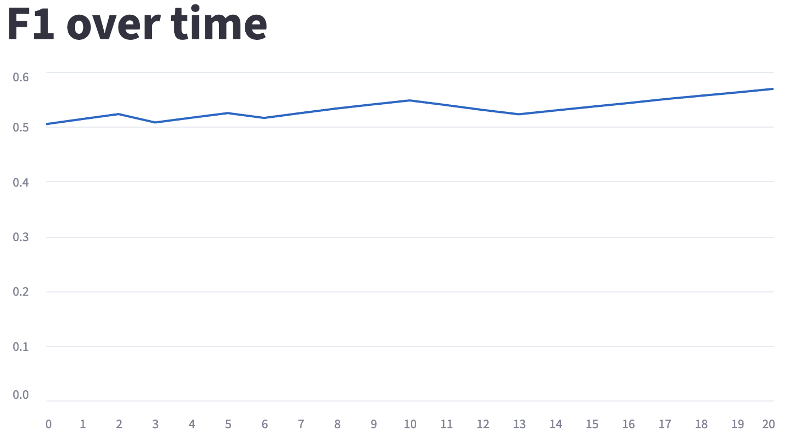
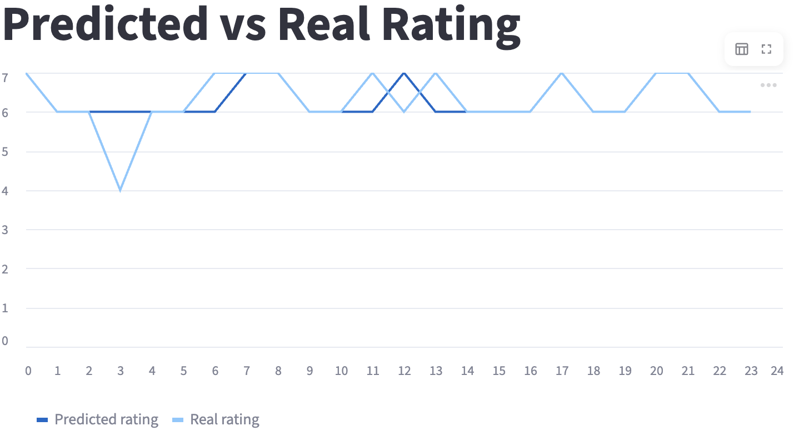
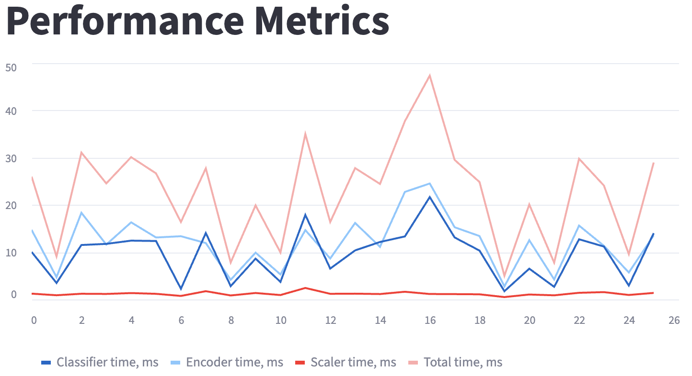

# Lab 1: Distributed Movie Rating Inference Pipeline

Distributed machine learning pipeline built with **Apache Kafka (KRaft, 3 brokers)**, Docker, and Streamlit.

The system processes movie rating data through multiple microservices and performs real-time inference using a trained classification model.

---

## Features

- 3-node Kafka cluster (KRaft mode, no ZooKeeper)
- Fault-tolerant topic replication (`replication-factor=3`)
- Streaming data processing pipeline
- Microservice architecture
- Fully containerized (Docker Compose) with private and public networks
- Real-time metrics dashboard (Streamlit)
- CI with `black`, `isort`, `pylint`

### Kafka Cluster

- 3 brokers (KRaft mode)
- Topic configuration:
  - `partitions = 3`
  - `replication-factor = 3`
  - `min.insync.replicas = 2`
- Broker 1 exposed externally for debugging with public network. External debugging access: `localhost:9094`
- Details in `./scripts/init_broker.sh`

### Topics

| Topic            | Description |
|------------------|------------|
| `raw-data`       | Raw dataset messages |
| `processed-data` | Preprocessed features |
| `results`        | Model predictions |

---

## Data Flow

### 1. Data Producer
- Reads dataset
- Sends messages to `raw-data`

### 2. Preprocessor
- Consumes `raw-data`
- Applies feature engineering
- Sends to `processed-data`

### 3. Inference Service
- Consumes `processed-data`
- Loads trained model
- Produces predictions to `results`

### 4. Client (Streamlit)
- Consumes `results`
- Displays:
  - F1 score
  - Predictions vs targets
  - Performance of parts of model: scaler, encoder, classifier

---

## Dataset and Model Performance
### Dataset
The dataset was created based on data provided by <a href="https://www.kaggle.com/datasets/anandshaw2001/imdb-data"> IMBD </a>, with the main purpose of film rating prediction (classification task). The final dataset contains only a part of the original dataset with preliminary processing of target to classification task. In addition, data analysis (EDA) was performed, which provided insight into the characteristics of the data, that was taking into consideration in the preprocessing stage final dataset.

### F1 Score


### Predictions vs Targets


### Performance


---

## Getting Started

### Requirements

- Docker ≥ 20.x
- Docker Compose ≥ v2

---

### Run the system

```bash
docker compose up -d
```

The dataset will be downloaded automatically on startup.
Alternatively, download it manually and place it into: mounted folder `./data`

After startup, open: http://localhost:8501

To stop the services run the command:
```bash
docker compose down -v
```

### View logs
```bash
docker compose logs -f
```
### Observability & Debugging
Check Kafka topics:

```bash
docker exec -it broker-1 kafka-topics.sh \
  --bootstrap-server broker-1:9092 \
  --describe --topic results
```
Consume manually:
```bash
docker exec -it broker-1 kafka-console-consumer.sh \
  --bootstrap-server broker-1:9092 \
  --topic results --from-beginning
```
## Project Structure
```
.
├── client/                 # Streamlit dashboard
├── data/                   # Dataset storage
├── docs/                   # Images and documentation
├── eda/                    # Exploratory Data Analysis notebooks
├── lib/                    # Kafka utilities and pipeline abstractions
├── model/                  # Trained model artifacts
├── scripts/                # Kafka initialization scripts
├── services/
│   ├── data_producer/      # Produces raw-data
│   ├── preprocessor/       # raw-data → processed-data
│   ├── inference/          # processed-data → results
```
## Services Overview

The system is built using a microservice architecture. Each service is isolated, stateless, and communicates exclusively via Apache Kafka topics.

All services are containerized and orchestrated via Docker Compose.

---

### 1. Data Producer

**Purpose:**  
Simulates incoming data stream.

**Responsibilities:**
- Download datasets from GDrive and put it into `./data` or reads dataset from `./data` if exists
- Serializes records
- Publishes messages to the `raw-data` topic

**Kafka Role:**
- Producer only

**Exposure:**
- Connected to public Docker network to download the dataset
---

### 2. Preprocessor

**Purpose:**  
Transforms raw input into model-ready features.

**Responsibilities:**
- Consumes messages from `raw-data`
- Performs feature engineering and preprocessing
- Publishes processed messages to `processed-data`

**Kafka Role:**
- Consumer (`raw-data`)
- Producer (`processed-data`)

---

### 3. Inference Service

**Purpose:**  
Performs ML inference using a trained model.

**Responsibilities:**
- Consumes from `processed-data`
- Loads trained classification model
- Produces predictions to `results`

**Kafka Role:**
- Consumer (`processed-data`)
- Producer (`results`)

---

### 4& Client (Streamlit Dashboard)

**Purpose:**  
Provides real-time visualization of predictions and metrics.

**Responsibilities:**
- Consumes from `results`
- Calculates metrics (e.g., F1 score)
- Displays:
  - Predictions vs Targets
  - Aggregated statistics
  - Live updates

**Kafka Role:**
- Consumer only

**Exposure:**
- Available at: `http://localhost:8501`
- Connected to public Docker network

---

## Service Communication Pattern

All services communicate exclusively through Kafka topics:


## CI Pipeline
GitHub Actions pipeline checks:
- Code style (black)
- Import sorting (isort)
- Linting (pylint)
